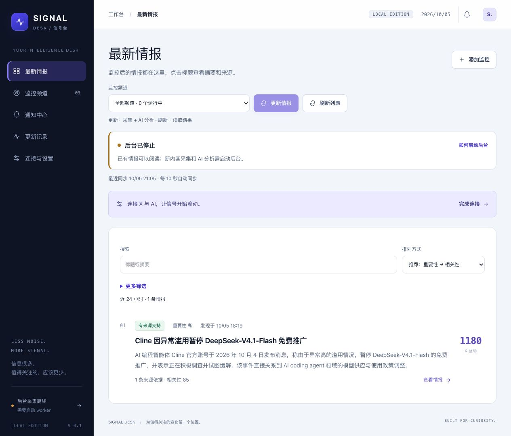

# Signal Desk · 热点信号台

一个面向 AI 编程与 Agent 等领域的本机热点监控工作台。它把多渠道线索转为可追溯的技术情报：先采集与基础过滤，再用 AI 初筛、聚合事件和逐项核验，最终展示摘要、影响与原文依据。

AI 接入 **OpenRouter**，X 接入 **twitterapi.io**，Google/Bing 使用 **SerpAPI**；站内通知和 SMTP 邮件支持持续提醒。频道默认每 **30 分钟**采集一次。项目还包含一个独立的 **Agent Skill**，通过已有 HTTP API 操作服务。

> 当前为单用户、本机使用版本。没有登录与多租户隔离，请保持 loopback 绑定；公开 GitHub 源码不等于可以直接把运行服务暴露到公网。仓库及源码包不包含密钥、邮箱账户、数据库或实际采集数据。

## 页面预览



实际运行页面截图：浅色阅读区、深色导航、更新/刷新入口、后台进度和来源信息。展示此前真实采集的公开单条样本；截图服务未配置上游凭证、未启动 worker，故如实显示后台停止。此图仅展示界面，不证明 OpenRouter 已真实联调。

## 目录

- [页面预览](#页面预览)
- [主要功能](#主要功能)
- [第一次使用](#第一次使用)
- [过滤信息的实现](#过滤信息的实现)
- [运行](#运行)
- [OpenRouter 配置](#openrouter-配置)
- [邮件配置](#邮件配置)
- [采集、分析与提醒](#采集分析与提醒)
- [AI 编程与 Agent 账号监控及筛选](#ai-编程与-agent-账号监控及筛选)
- [Agent Skill 使用](#agent-skill-使用)
- [技术结构与本机 API](#技术结构与本机-api)
- [验证与发布范围](#验证与发布范围)

## 主要功能

| 能力 | 具体行为 |
| --- | --- |
| 关键词/领域频道 | 主关键词、同义词、排除词、来源、间隔、相关性及提醒策略可按频道调整 |
| 多渠道采集 | X、Hacker News、GitHub、RSS/Atom、Google、Bing；一个来源失败不阻塞其它来源 |
| X 专题监控 | 精选账号与关键词双通道、关注/屏蔽名单、互动门槛、新帖观察和到期复查 |
| 分阶段 AI | 候选初筛 → 事件聚合 → 原文/根帖/补查 → 深度核验；保存队列、失败和调用审计 |
| 可追溯情报 | 摘要、影响、重要性、相关性、证据状态、逐项说法及原文引用和缺口 |
| 阅读与更新 | 首页直接阅读；更新情报排队采集+分析，刷新列表只读取结果；每 10 秒同步后台状态 |
| 筛选与排序 | 来源、频道、时间、证据状态、重要性、相关性、账号范围及 X 互动；服务端筛选后分页 |
| 站内和邮件提醒 | 冷却、版本去重、首轮历史提醒抑制、失败有限重试；默认不提醒待核实或争议内容 |
| 预算控制 | AI 日调用/token、X 日/月/单轮、搜索日/月与补查额度；预算不足暂停而非无界重试 |
| 独立 Skill | 自然语言驱动现有服务的读取、频道管理和按需更新；不改业务实现、不自动安装 |

## 第一次使用

1. 按“运行”安装依赖，按“OpenRouter 配置”和“邮件配置”创建本机环境文件。
2. 分别启动 Web 与 worker，两者使用同一 `DATABASE_URL`（默认 `data/hotspot.db`）。
3. 在“监控频道”创建关键词或领域频道；关注 AI 编程可应用专题，使用精选账号和标准互动策略。需要持续采集时启用频道。
4. 首页选择频道，点击 **更新情报**；顶部显示采集、AI 初筛、深度核验、排队、预算暂停或等待重试。
5. 分析完成后结果出现在 **最新情报**；点击标题阅读摘要、来源与引用，展开核验细节。**刷新列表**只读取已有结果，不发起新的 X/AI 调用。
6. 没看到结果时先检查“更多筛选”的时间范围，再看后台是否在线、频道是否暂停，以及“更新记录”的来源异常和过滤原因。采集了原始材料并不保证产生可展示事件。

自动 AI 分析默认关闭，手动更新/分析会显式排队；需要持续自动分析时在“连接与设置”开启。暂停频道仍可手动更新，不会因此打开定时任务。Web 关闭后 worker 可继续工作，电脑休眠和进程停止会影响采集。

## 过滤信息的实现

处理顺序是 **数据采集 → 基础过滤 → AI 初筛与深度分析 → 展示与提醒**。过滤不是直接删除数据：保留原始材料、发现渠道、过滤原因与队列状态，便于复查。以下规则已实现，参数可以按频道或全局设置调整。

| 阶段 | 实现与规则 | 代码入口 |
| --- | --- | --- |
| 来源边界 | X Latest + Unix 秒窗口，账号/关键词分别保存分页游标；公开外链与正文抓取独立记录结果 | [scanner.ts](src/server/scanner.ts)、[sources.ts](src/server/sources.ts) |
| URL/正文去重 | 移除 URL fragment、utm 和常见跟踪参数；规范化 URL、正文指纹及近重复检测；相同材料保留多发现路径 | [quality.ts](src/server/quality.ts)、[article-store.ts](src/server/article-store.ts) |
| 基础内容过滤 | 空内容、屏蔽账号、纯转发、无实质回复；技术报错/代码/复现等实质回复可保留 | [quality.ts](src/server/quality.ts) |
| X 互动门槛 | 普通账号标准策略为点赞≥10 **或**转发≥3 **或**回复≥5；严格为 50/10/15；宽松不设门槛，自定义可调 | [quality.ts](src/server/quality.ts) |
| 新帖观察 | 低互动新帖默认观察 120 分钟；期满按预算查询最新互动后判断，查询失败/预算不足不使用旧数据最终过滤 | [x-observation.ts](src/server/x-observation.ts) |
| 名单与身份 | 精选/关注及已识别官方账号可豁免互动门槛，仍需内容过滤、相关性与证据核验；认证/粉丝仅作元数据 | [x-accounts.ts](src/shared/x-accounts.ts)、[config.ts](src/server/config.ts) |
| 时间处理 | 默认活跃事件窗口 72 小时，已知旧材料作为背景；未知日期保留边界，不能描述为刚发布 | [pipeline.ts](src/server/pipeline.ts) |
| AI 初筛 | 每条候选须有相关性、信息价值和理由；默认批次 3，最多 5，按长度切分；漏项不算已处理 | [analysis-stages.ts](src/server/analysis-stages.ts) |
| 聚合与深度核验 | 主体/行动/版本/时间共同约束聚合；获取原文和有限父帖、在搜索预算内补查；核对具体说法与反证 | [pipeline.ts](src/server/pipeline.ts)、[thread-context.ts](src/server/thread-context.ts) |
| 引用防伪 | 服务生成原文片段 ID，AI 选择 ID，本地恢复原文；拒绝未知文章、重复引用、伪造片段及 Schema 无效输出 | [analysis-stages.ts](src/server/analysis-stages.ts)、[ai.ts](src/server/ai.ts) |
| 独立证据判定 | 一手/独立/转载/未知角色；同发布者、同原文、相同/近重复正文不重复增加独立性；摘要不升级为全文 | [ai.ts](src/server/ai.ts)、[quality.ts](src/server/quality.ts) |
| 展示与提醒 | 频道相关性和全局价值阈值先限定可见结果；再次执行用户筛选、排序、分页；提醒另有证据与冷却规则 | [feed.ts](src/shared/feed.ts)、[repository.ts](src/server/repository.ts)、[scanner.ts](src/server/scanner.ts) |

### X 账号与互动不是“真假”的替代品

预置 8 个账号：OpenAI、AnthropicAI、cursor_ai、cline、opencode、LangChain、simonw、steipete。名单包含机构和领域开发者，来源核对依据可在设置中查看和维护。它提高发现效率，不能自动把发布内容视为事实。网页的“官方账号”筛选依据发布者身份目录，和“精选账号”筛选不是同一个集合。

关注列表只在启用精选采集或明确关注时影响采集；屏蔽优先。精选/官方的豁免只针对采集阶段互动门槛；用户在结果页主动选择“标准/严格互动”时，结果仍需满足所选互动条件。

### 证据状态是什么意思

| 状态 | 判定边界 |
| --- | --- |
| 有来源支持 `supported` | 已识别一手材料支持引用的具体说法；机构的性能宣传不等于独立测评 |
| 多源支持 `corroborated` | 至少两组已识别发布者的独立材料支持；不同搜索引擎命中同一文章不算两份证据 |
| 待核实 `unverified` | 证据、正文或发布者身份不足；有价值的线索仍可展示，不直接判为假 |
| 存在争议 `disputed` | 核心说法存在关键矛盾，保留支持/反证和缺口，默认不提醒 |

AI 输出经过本地结构及引用校验，但系统不承诺事实正确率。身份目录由人工维护，文字不同但共同来源的报道仍可能无法自动识别。完整抓取也只能证明读取了内容，不证明作者结论真实。

## 运行

需要 Node.js 24.16 或更高版本。开发与实际验证使用 Node 24.16.0，依赖版本锁定在 package-lock.json。

```sh
rtk proxy npm ci
rtk proxy npm run db:migrate
rtk proxy npm run dev
```

另开终端，在同一项目目录启动后台：

```sh
rtk proxy npm run worker
```

打开 http://127.0.0.1:3000。Web 和 worker 必须读取同一个数据库与环境文件；网页关闭不会停止 worker，电脑休眠或进程退出会停止扫描。

生产运行：

```sh
rtk proxy npm run build
rtk proxy npm start
```

仍需另开终端运行 worker。Web 默认绑定本机 loopback，worker 是本机后台进程；首版没有登录、多用户或公网部署能力。

## OpenRouter 配置

从 .env.example 新建 .env.local；已有 .env.local 时只编辑所需项，保留原配置。密钥只在服务端读取，请勿使用 NEXT_PUBLIC_ 前缀。

```dotenv
OPENROUTER_API_KEY=填写你的令牌
OPENROUTER_BASE_URL=https://openrouter.ai/api/v1
AI_MODEL=填写模型列表中的完整vendor/model ID
AI_OUTPUT_MODE=json_object
TWITTERAPI_API_KEY=填写twitterapi.io的Key
SERPAPI_API_KEY=可选，Google与Bing共用一个Key
```

从 [OpenRouter Keys](https://openrouter.ai/settings/keys) 创建 Key，在 [模型列表](https://openrouter.ai/models) 选择模型并填写完整 `vendor/model` ID。标准地址为 `https://openrouter.ai/api/v1`，程序只向该官方 HTTPS 域名发送令牌，不提供推广排名请求头。没有预设收费模型；请自行确认模型可用性、价格和参数支持。

公开版使用 Chat Completions，支持 `json_schema`、`json_object` 与提示词 JSON 模式。默认 `json_object`，仍需选择支持该模式的模型；所有返回继续经过本地 Schema 与逐字引用校验。模型不支持当前模式时保留材料并报告失败，不静默切换模型或降低校验要求。

推理默认遵循模型设置；可在页面请求关闭推理，分阶段请求使用 OpenRouter 的 `reasoning: {enabled: false}`。部分模型强制推理，关闭参数可能返回错误；应切回默认模式或选择支持关闭的模型。本次依据 Context7 查询 OpenRouter 官方文档完成适配和模拟回归，没有 OpenRouter 账户凭证，**尚未进行 OpenRouter 真实调用**。历史本机版的 AI 验收不能作为此平台已联调的证明。

从旧版本迁移时先备份数据库，填写新的 OpenRouter 环境变量后重启 Web 和 worker，并在“连接与设置”保存新地址、完整模型 ID、输出模式及默认推理设置；程序不自动改写已有频道或数据库中的 AI 配置。

“连接与设置”的偏好保存在数据库，优先于环境默认值；模型为空时回退到 AI_MODEL。默认扫描间隔只影响新频道，已有频道请单独编辑。API Key / SMTP 修改后重启 Web 和 worker；页面偏好无需重启。

## 邮件配置

```dotenv
SMTP_HOST=你的SMTP服务器
SMTP_PORT=465
SMTP_SECURE=true
SMTP_USER=邮箱账号
SMTP_PASSWORD=邮箱授权码或SMTP密码
EMAIL_FROM=发件邮箱
EMAIL_TO=收件邮箱
```

587 端口一般使用 `SMTP_SECURE=false`，程序要求 STARTTLS 且保留证书校验。按邮箱服务商规则配置授权码及发件地址。在“连接与设置”点击测试按钮会实际请求 API / 发送测试邮件。

SMTP 已接受表示服务器接受了目标收件人，不保证最终进入收件箱。发送超时等临时错误最多尝试 3 次；认证或永久投递错误停止自动重试，可在通知中心修正配置后手动重试。稳定 Message-ID 辅助去重，SMTP 无法承诺严格只投递一次。

## 采集、分析与提醒

1. 创建关键词频道或领域发现频道，选择 X、HN、GitHub、RSS、Google、Bing，并配置同义词和排除词。多个查询词通过“同义词 / 扩展词”逗号分隔；主关键词作为一个完整查询短语。
2. worker 每 5 秒分别处理到期采集、候选初筛、事件深度核验、邮件投递。频道默认 30 分钟，暂停的频道也可手动扫描；“分析已有材料”只处理分析队列，不重新搜索。
3. X 使用 Latest + Unix 秒时间边界。精选账号与关键词搜索分别采集、保存游标；普通账号默认满足点赞≥10 或转发≥3 或回复≥5 才进入 AI，支持宽松/标准/严格/自定义。精选与已确认官方账号豁免互动门槛，但仍需相关性和证据核验。低互动新帖默认观察 120 分钟，按预算复查后再判断；闲聊回复、纯转发、空内容、屏蔽账号作基础过滤，原始记录和原因保留。帖子短链接可按公开地址与重定向规则读取原文。已有频道保留宽松策略，编辑时可应用“AI 编程与 Agent”专题。
4. 按 URL/相同正文去重并保留发现路径，按来源和等待时长公平入队。默认每频道每轮最多入队 200 条；这是处理上限，不保证采到固定数量。超过 72 小时的已知旧材料作为背景，未知日期允许分析但不能冒充新发布。
5. 初筛每批默认 3 条、实际最多 5 条，并按输入长度切分。每条必须有相关性、信息价值和处理理由；漏项不能算已分析。模型建议按主体、行动、版本、日期聚合，字段不同不静默合并。
6. 入选事件读取原文、有限追溯 X 父帖，并在搜索预算内补查。长文保留最多 30,000 字符，按说法从全文选取相关段落，明确未读取和截断边界。深度分析复用事件簇中的既有与新增证据，输出具体说法、支持/不足/反证、影响和缺口。AI 选择服务器提供的短原文片段 ID，由本地验证并还原；每项说法可查看对应原文，不接受模型改写引用。
7. 本地继续拒绝未知文章 ID、重复引用、伪造片段和不符合 Schema 的结果；逐字引用还必须来自本轮实际提供的段落。有来源支持、多源支持、待核实、存在争议分别展示；缺少证据不等于假，宣传不等于实测。
8. “连接与设置”配置自动分析、日调用/token预算、信息价值阈值和事件窗口；升级默认暂停自动分析，用户可显式启用。默认 60 次/天、200,000 tokens/天，初筛最多使用 80% 总预算。实际输入和最大输出在调用前保守预留，失败或缺失 usage 不按免费统计；日计数按 Asia/Shanghai。
9. 任务有持久化状态、租约和有限重试；截断缩小初筛批次，成功项不重复处理。预算恢复后继续，失败可在“从线索到情报”重试。调度与来源缺失不会伪造热点。
10. 首轮历史内容不发送提醒。符合相关性、价值、证据及冷却条件的事件产生通知；默认不提醒待核实，争议不提醒。“有价值/不相关/重复/证据不足”反馈仅用于调优，不自动成为可信证据。

HN 保留讨论页，并按原文预算获取公开外链；讨论与原始文章分别保存。GitHub 默认搜索近期更新仓库（有限样本），配置 owner/repo 后读取实际 Releases；预发布明确标记，仓库更新不代表正式发布，Star 总量不代表增长。RSS 默认使用 Hugging Face、Google AI、GitHub Blog、DeepMind 四个已实际读取的订阅，支持自定义公开 RSS/Atom；读取失败会独立记录，不阻断其他来源。

Google / Bing 通过 [SerpAPI](https://serpapi.com/dashboard) 共用一个 Key。设置 `SERPAPI_API_KEY` 后重启 Web 和 worker，在频道编辑窗口勾选网页来源。已有频道的来源不会自动添加。基础采集默认 30 分钟；网页默认 240 分钟，可修改，实际触发还受频道基础间隔约束。

全局默认搜索预算 30 次/天、900 次/自然月、事件补查 6 次/天。日/月按 Asia/Shanghai 计数；补查也计入总搜索额度。达到上限会暂停搜索，其他来源继续。成功检索缓存 1 小时、失败退避 15 分钟；本机按实际尝试保守计数，账单以供应商为准。原文默认每个深度任务最多抓取 6 个 URL、并发 2，正文与补查共享上限；纯链接候选初筛前额外最多读取 2 个原文。X 父帖每个任务最多查询 2 层、每次最多 3 个 ID，默认最多 10 次/天；成功缓存 4 小时、失败缓存 30 分钟。

搜索摘要仅用于发现线索；HTML 正文使用 Mozilla Readability 提取，动态页面、登录页、非 HTML 或失败抓取不会显示为全文。搜索摘要的相对日期不当作发布日期，未知时间显示为未知，不触发新发布提醒。相同 URL/全文只存一份，保留发现渠道；同发布者和近乎逐字转载不增加独立证据。语义相近但文字不同的共同来源仍可能无法自动识别，证据状态不是事实正确率。

“连接与设置”可管理发布者身份与核对依据；关注账号只调整采集优先级，不自动赋予可信身份。新规则会重评历史候选并保留过滤审计；历史事件不会因此自动重发提醒。

## 本机网络代理

Web 和 worker 通过 Node 官方 `--use-env-proxy` 启动，读取启动环境中的 HTTP_PROXY、HTTPS_PROXY、NO_PROXY。已有可信代理时，设置 `NO_PROXY=localhost,127.0.0.1,::1` 以绕过本机服务；不要输出包含凭证的代理地址。公开原文/RSS 请求使用匹配版本的 Undici request；代理 CONNECT 固定已校验的公开目标 IP，保留 Host、TLS SNI 与证书校验。重定向逐跳校验，正文身份按实际最终地址判断。无需关闭 TLS 校验。

## 数据与检查

SQLite 默认 `data/hotspot.db`，开启 WAL / 外键 / busy timeout。迁移位于 drizzle/，启动会自动应用。旧库首次应用分阶段分析迁移前，会用 SQLite VACUUM INTO 自动生成同目录 backups/before-analysis-pipeline-*.db 一致备份；失败时不会继续迁移。备份请先停止写入进程，再保存数据库及其 WAL 文件；不要删除目录或用批量清理命令重置数据。测试使用独立临时数据库，不修改应用数据。

```sh
rtk proxy npm run typecheck
rtk proxy npm test
rtk proxy npm run db:generate
rtk proxy npm run db:migrate
rtk proxy npm run build
rtk proxy npm audit
```

结构：`src/app` 页面和 API；`src/server/sources.ts` 采集；`ai-client.ts` OpenRouter 协议；`analysis-stages.ts` 分层分析；`ai.ts` 证据校验；`ai-budget.ts` 费用审计；`pipeline.ts` 分阶段队列；`article-store.ts` 去重持久化；`scanner.ts` 采集调度；`mail.ts` 投递；`scripts/worker.ts` 常驻后台。

分阶段方案见 [分析流程方案](docs/analysis-pipeline-v2-plan.md)，最终实现、95 项回归、真实材料对照、调用费用边界与当前验收入口见 [V2 验收记录](docs/analysis-pipeline-v2-validation-2026-10-05.md)。

SerpAPI真实验证见 [搜索联调记录](docs/serpapi-validation-2026-10-05.md)。本轮验证见 [信息源可靠性验收记录](docs/reliability-validation-2026-10-05.md)。历史验证结果与待验收项见 [验收记录](docs/acceptance.md)，技术来源见 [MCP 依据](docs/api-reference.md)。用户在 Web 联调与界面确认后授权封装 Skill；独立目录与使用方式见下文。

## AI 编程与 Agent 账号监控及筛选

首页“最新情报”直接阅读分析后的结果；“更新情报”排队采集与 AI 分析，“刷新列表”仅同步已有结果。后台进度在顶部展示，复杂筛选默认折叠；原始材料、分析队列与错误集中到“更新记录”。使用流程与预览见 [首页简化验收](docs/home-ux-validation-2026-10-05.md)。

在频道编辑窗口应用专题，可启用首批 8 个精选 X 账号、标准互动策略和 30 分钟扫描；名单在“连接与设置”中增删或暂停。自定义额外账号也会主动采集。精选名单只用于采集和优先级，不自动赋予可信状态；蓝 V 单独展示，不能证明专业性或真实性。

X 总预算默认 144 次/天、4320 次/自然月，每频道每轮最多 3 次请求；账号、关键词、互动复查、父帖和连接测试共用日月额度，失败也计数。观察期已结束但复查失败或预算不足时，材料保留在“新帖观察中”，不以旧互动数据最终过滤。到期复查先占一轮请求，剩余额度用于账号及关键词；单轮不足覆盖两条通道时轮换，未完成窗口保留游标。数量按本机请求尝试保守预扣，供应商收费可能按返回记录数计算。

为避免连续调用限流，本机同一数据库中的所有 X API 入口共享请求时间槽，默认间隔 6 秒；可在 `.env.local` 调整 `X_REQUEST_INTERVAL_MS`（允许 1200–15000 毫秒）。此默认值是保守本机策略，不代表账户套餐的官方 QPS，仍可能收到上游 429。

总览支持多来源、多频道、重要性、可信度、相关性、账号范围、X 互动门槛和时间筛选。同维度 OR、跨维度 AND，选择保存在当前浏览器。服务器先筛选完整事件库再分页，每页 30 条。时间默认首次发现；可靠发布时间未知时，在限时发布筛选中排除、在发布排序中置后。推荐排列按重要性→相关性→首次发现；X 社交热度仅使用点赞+转发×3+回复×2，与旧综合推荐分不同。旧事件重要性显示“未评估”，重新分析后更新。

账号管理、预算、文章元数据、重要性与时间字段复用现有 JSON 设置及记录，不另做破坏性数据迁移。真实联调与验收边界见 [X 监控与筛选验收记录](docs/x-watch-validation-2026-10-05.md)。


## Agent Skill 使用

Skill 位于 [skills/signal-desk/](skills/signal-desk/)，本仓库只分发文件，**没有安装到作者或使用者本机的 Skills 目录**。它不是独立的采集服务或 MCP server：调用已运行的 Signal Desk Web，再由原 worker 执行任务，所有预算、过滤、证据和提醒规则继续由原应用负责。

```text
skills/signal-desk/
  SKILL.md                       技能入口与操作边界
  agents/openai.yaml             Agent UI 元数据
  scripts/signal_desk.py          Python 标准库 HTTP 客户端
  references/api.md              命令、筛选和频道 JSON
  references/evidence.md         证据与状态解释
  assets/ai-coding-monitor.json   暂停的专题频道示例
  tests/test_client.py            本机模拟 HTTP 测试
```

直接在仓库根目录调用（Python 3.9+，无额外运行依赖）：

```sh
python3 -B skills/signal-desk/scripts/signal_desk.py --base-url http://127.0.0.1:3000 status
python3 -B skills/signal-desk/scripts/signal_desk.py --base-url http://127.0.0.1:3000 monitors
python3 -B skills/signal-desk/scripts/signal_desk.py --base-url http://127.0.0.1:3000 events --filters '{"hours":"24","sort":"recommended"}'
```

项目代理执行时按 AGENTS.md 在命令前加 `rtk proxy`。端口也可通过 `SIGNAL_DESK_URL` 指定；不要将本机预览端口当所有用户的默认地址。相对支持文件路径以 Skill 目录为基准。

Agent 使用示例：

- “读取 `skills/signal-desk/SKILL.md`，连接我的本机服务，查看近 24 小时 AI Agent 情报，给出原文与证据状态。”
- “使用 `$signal-desk` 更新 AI 编程与 Agent 频道，说明后台进度与是否已经完成。”（使用者自行在兼容客户端加载此 Skill 后）
- “只分析已有材料，不重新采集。”

创建频道可使用提供的 JSON 示例；封装默认新建暂停频道。`update` 采集并分析，`analyze` 只处理已有材料（核验可能补查），均先检查 worker 心跳。查看列表只读，不主动消耗 X/AI 额度；更新、分析和启用频道可能产生额度与提醒。CLI 不提供密钥/全局设置修改、发送测试邮件或上游连接测试。

客户端只连接 loopback 根地址，拒绝重定向，不传上游凭证，不使用环境代理转发本机请求。超时不自动重复写入；先检查状态，以免重复提交。详细命令、HTTP 映射、筛选枚举与编辑边界见 [Skill API 参考](skills/signal-desk/references/api.md)。

## 技术结构与本机 API

| 部分 | 技术/职责 |
| --- | --- |
| Web | Next.js 16.3.8 App Router + React 19.3.0 + TypeScript，浅色内容区/深色侧栏 |
| 视觉 | Tailwind CSS 4.3.3、Aceternity UI Spotlight/Bento；轻量效果与 reduced-motion 适配 |
| 数据 | SQLite + better-sqlite3 13.0.3 + Drizzle 0.45.3；持久化队列、租约、审计及增量迁移 |
| AI | OpenRouter OpenAI 兼容 Chat Completions；Zod 4 结构和本地引用校验 |
| 正文 | Mozilla Readability + JSDOM；公开 URL 校验、重定向逐跳校验和大小/并发上限 |
| 后台 | 独立 Node worker；采集、初筛、深度、邮件分阶段处理 |
| Skill | Python 3.9+ 标准库，调用现有 HTTP API，无本地数据库直读 |

```text
src/app/                 页面、交互组件与 API Route Handler
src/components/ui/       Aceternity UI 组件
src/server/              采集、过滤、原文、AI、队列、预算及邮件
src/shared/              类型、校验 Schema、结果筛选和 X 名单
scripts/                 worker、迁移与有边界的联调脚本
drizzle/                 SQLite 增量迁移与 Schema 快照
tests/                   独立临时数据库业务回归
skills/signal-desk/      独立的 Agent Skill 分发目录
docs/                    方案、MCP 技术依据、真实联调及验收边界
```

| API | 用途 |
| --- | --- |
| GET `/api/dashboard` | 配置状态、频道、有限近期记录、后台进度、预算；不是整个事件库 |
| GET `/api/events?filters=<URL编码JSON>&page=1` | 完整事件库筛选后分页，每页 30 条 |
| GET `/api/events/:id` | 单条情报及实际引用文章 |
| POST `/api/monitors` / PUT `/api/monitors/:id` | 新建/完整保存频道 |
| PATCH `/api/monitors/:id` | `{"active":true/false}` 切换定时任务 |
| POST `/api/monitors/:id/scan` | 采集与分析一起排队 |
| POST `/api/monitors/:id/analyze` | 仅已有材料分析排队 |
| POST `/api/analysis/:id/retry` | 任务重试 |
| POST `/api/events/:id/feedback` | 保存用户反馈 |
| POST `/api/notifications/:id/read` / `retry` | 已读/手动重试邮件 |
| PUT `/api/settings` | 全局设置（调用前读原设置，防止默认字段覆盖） |
| POST `/api/connections/:type` | 实际连接测试；type 为 x/ai/email/google/bing，会请求上游或发邮件 |

所有写请求使用 `Content-Type: application/json`，无字段也发送 `{}`；请求正文上限 20,000 字节。跨站 Origin 拒绝；这不是登录鉴权。字段定义以 [共享类型](src/shared/types.ts)、[筛选 Schema](src/shared/feed.ts) 和 [Route Handler](src/app/api/[...path]/route.ts) 为准。

## 验证与发布范围

公开版已切换 OpenRouter；旧文档里的实际 AI 调用来自当时的本机兼容服务，不能推断为 OpenRouter 已真实联调。当前协议和验证见 [OpenRouter 发布版说明](docs/openrouter-publication.md)。

截至 2026-10-05，OpenRouter 公开版 6 个 Vitest 文件、120 项通过，类型检查、生产构建与桌面/手机浏览器验收通过。独立 Skill 的 14 项模拟 HTTP 测试通过，验证 UTF-8、重定向阻止、写入格式、离线不排队、部分编辑保留配置等；模拟测试不视为实际 X/AI 联调。Skill 另外通过已运行的隔离 Web 只读验证真实既有情报，未新增上游请求。

```sh
rtk proxy npm test
rtk proxy npm run typecheck
rtk proxy python3 -B -m unittest discover -s skills/signal-desk/tests -v
```

构建/迁移的使用见前文；验证新数据库时设置独立的 `DATABASE_URL`，不要用业务数据库做测试。实际外部调用需配置自己的账户、预算与模型；测试脚本不是免费的连通性探测，执行前查看脚本和费用边界。

公开发布使用当前已审查源码快照；不上传本地旧 Git 历史、`.env`/`.env.local`、SQLite/WAL/备份、采集结果、邮件账户、运行日志、无关截图/测试输出（README 展示图除外）、node_modules、构建缓存。本机路径在分发文档中改为通用路径；本次公开版 AI 适配范围见上文，作者本机正在运行的私有配置不变；压缩包和 GitHub 代码来自同一份发布快照。`.env.example` 仅含空凭证与公开服务地址。

历史联调文档中的端口、费用和样本数量仅代表当次验证；不是永久在线服务、性能承诺或供应商套餐保证。生成产物链接若指向 `output/`，在公开源码包中不可用。启动后没有伪造示例热点，真实结果需使用者按自身账户采集和分析。
